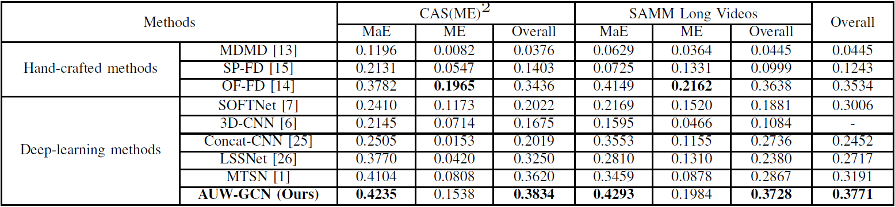

# AUW-GCN-for-ME-Spotting
PyTorch implementation for the paper "AU-aware graph convolutional network for Macro- and Micro-expression spotting" (**ICME 2023**, 
long paper): [IEEE version (Coming soon)](),  [arXiv version](https://arxiv.org/pdf/2303.09114.pdf).


> The code is modified from [USTC_ME_Spotting
](https://github.com/wenhaocold/USTC_ME_Spotting).

## Results
We compare our method against others on two benchmark datasets, i.e., [CAS(ME)<sup>2</sup>](http://fu.psych.ac.cn/CASME/cas(me)2-en.php) and [SAMM-LV](http://www2.docm.mmu.ac.uk/STAFF/M.Yap/dataset.php) in terms of F1-Score:



## Experiment environment 
OS: Ubuntu 20.04.4 LTS 

Python: 3.8

Pytorch: 1.10.1

CUDA: 10.2, cudnn: 7.6.5

GPU: NVIDIA GeForce RTX 2080 Ti

## Getting started
1. Clone this repository
```shell
$ git clone git@github.com:xjtupanda/AUW-GCN.git
$ cd AUW-GCN
```

2. Prepare environment

```shell
$ conda create -n env_name python=3.8
$ conda activate env_name
$ pip install -r requirements.txt
```

3. Download features

For the features of SAMM-LV and CAS(ME)^2 datasets, please download [features.tar.gz](
https://pan.baidu.com/s/1Pj_CnnypSfNOTaSO1BFKdg?pwd=mpie) 
(Modified from 
[USTC_ME_Spotting#features-and-config-file](https://github.com/wenhaocold/USTC_ME_Spotting#features-and-config-file)) and extract it:
```shell
$ tar -xf features.tar.gz -C dir_to_save_feature
```
After downloading the feature files, the variables of feature path, `segment_feat_root`, in [config.yaml](https://github.com/xjtupanda/AUW-GCN/blob/main/config.yaml) should be modified accordingly.

4. Training and Inference

Set `SUB_LIST`, 
`OUTPUT` (dir for saving ckpts, log and results)
and `DATASET` ( ["samm" | "cas(me)^2"] )  in [pipeline.sh](https://github.com/xjtupanda/AUW-GCN/blob/main/pipeline.sh), then run:
```shell
$ bash pipeline.sh
```

**We also provide ckpts, logs, etc.** to reproduce the results in the paper, please download [ckpt.tar.gz](https://pan.baidu.com/s/1U-LEYH_fGOwgeToJ2Abhlw?pwd=5kan).
## Citation
If you feel this project helpful to your research, please cite our work.
```
@inproceedings{Yin2023AUawareGC,
  title={AU-aware graph convolutional network for Macro- and Micro-expression spotting},
  author={Shukang Yin and Shiwei Wu and Tong Xu and Shifeng Liu and Sirui Zhao and Enhong Chen},
  year={2023}
}
```

##### Please email me at xjtupanda@mail.ustc.edu.cn if you have any inquiries or issues.
